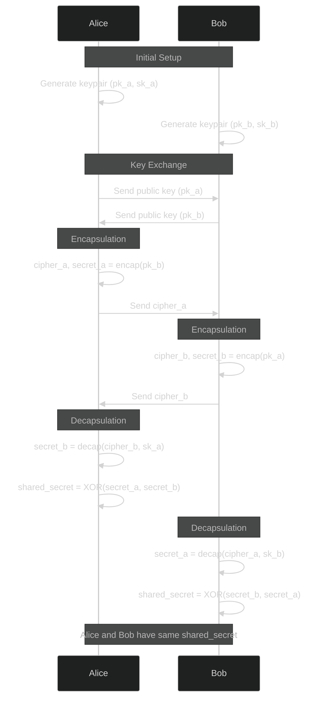

import { Button } from '@/components/ui/button'
import Link from 'next/link'
import { Github, Linkedin } from 'lucide-react'

<div className='mb-8 flex align-middle gap-2'>
    <Link href="https://github.com/hlminh2000/pqchat" target='_blank'>
        <Button><Github /></Button>
    </Link>

    <Link href="https://pqchat.minhified.codes" target='_blank'>
        <Button>Check out the app</Button>
    </Link>
</div>

# TL;DR
- I built a toy end-to-end encrypted chat app for fun using modern web tools: Next.js, WebRTC, and Ably.
- Experimented with encryption using mlkem, a post-quantum key exchange mechanism.
- Learned about the trade-offs of using WebRTC, including the need for signaling and TURN servers despite being "peer-to-peer."
- Faced challenges like serverless signaling and handling WebRTC connection stability.
- Limitations: No public key authentication, only supports 1-on-1 chats, and relies on free-tier services.
- Overall, it was an enjoyable learning project blending cryptography theory with practical implementation.

# Introduction

On a daily basis, I often find myself on calls working with colleagues on our infrastructures. We
often have the need to send each other commands / snippets of code that have some secrets in them.

There are clearly already solutions out there for sharing ephemeral secrets (such as [this one](https://www.crypt.fyi/)), 
but I frankly don't always feel comfortable using a third-party tool. So I figured, this might be 
a fun opportunity to write a fun tool for myself.

More than anything, this is an excuse to have some fun building stuff, and it sure was fun.

# The Tech Stack

- **Next.js**
    
    Easy decision here, this is the most flexible and feature-rich way to build a web app these 
    days IMO.

- [**mlkem**](https://www.npmjs.com/package/mlkem)
    
    A JS implementation of the ML-KEM key encapsulation recently standardized by NIST. This
    implementation was done by [Ajitomi Daisuke](https://github.com/dajiaji) at Toshiba. 

    We'll briefly cover Key Encapsulation Mechanism in a little more detail below.

    大介さん、ありがとうございます！

- **WebRTC**

    Ideally, I wanted the chats to be peer-to-peer without flowing through any server. Nevertheless,
    some backend was still necessary for the signaling... I was going to keep things simple by
    making a simple websocket relay, but changed my mind when I decided on deployment with:

- [**Vercel**](https://vercel.com/)

    This choice does place a limitation since Vercel doesn't provide any support for long-running
    processes (I kind of miss ZEIT's `now.sh` here). 
    
    Since I need a signaling channel without my own server, a third-party pubsub or message broker
    was needed, for which I went for:

- [**Ably**](https://ably.com/)

    Basically a cloud-hosted pubsub as a service. They have a ton of features, but I just needed
    something simple enough to let me send a JSON from one client to another.

- [**Metered**](https://metered.ca/)
    
    Despite being p2p, WebRTC still often requires the fallback to TURN servers in practice. Metered
    provide these as a service, with a free tier.

- [**Auth0**](https://auth0.com/)
    
    To be able to let users know who they are talking to, I still wanted a user identity system.
    Clearly rolling my own was not worth it for myself as the developer, nor as a user. So I went
    for the good-old Auth0.

# On Key Encapsulation (KEM)
I wanted to dedicate a small section on KEM and key exchange, since most folks are not cryptographers
(neither am I).

You're probably familiar with symetric encryption, where a secret string is used to encrypt and
decrypt data. This is great for secure securing data at rest, where encryption and decryption is
performed by the same key, it is not directly useful when trying to secure a communication channel.

## The problem
If Alice and Bob wants to send encrypted messages to each other, they first need to agree on a common
encryption & decryption key. However, if this key was directly sent over the same communication channel, 
any observer of the channel now has access to the key, which defeats the purpose.

We need a way for Alice and Bob to agree on a secret key, without having to ever explicitly communicate
such key out loud. This is where asymetric cryptography helps.

## The solution
Unlike symetric cryptography where only one key is generated and used for both encryption and
decryption, we asymetric algorithms generate a key pair, typically called:
- **Public key (`pk`)**: can be used to encrypt data, but not decrypt
- **Secret key (`sk`)** (aka, private key): can be used to decrypt data

The trick is basically, for one (or both) sides to generate their own keypairs, then share their `pk`
with each other. This helps because:
    1. It's ok if an observer gets hold of the `pk`, they won't be able to use it to decrypt anything.
    1. Each side can use the other's `pk` to encrypt messages, and decrypt messages they received
    with their own `sk`.

With asymetric cryptography, Alice and Bob can now securely send messages to each other.

In practice however, the `pk` and `sk` are not used to directly secure the messages, but instead are
used to exchange a shared symetric key which can then be used to secure the messages.This is because
symetric algorithms are a lot more efficient, as long as the agreed upon shared secret is kept secure,
the communication can then be secured with good old symetric algorithms.

For this app, I've implemented a pretty common key-exchange mechanism that looks like the below:



# Challenges

## Serverless Signaling  
One of the trickiest parts was figuring out how to handle signaling without a dedicated server. 
WebRTC requires an initial exchange of information (like session descriptions and ICE candidates) 
to establish a connection between peers. Initially, I thought about spinning up a simple WebSocket 
server, but that felt like overkill for this project. Using Ably simplified things a lot, but it 
means I'm relying on another third-party service. It’s a tradeoff, but for a toy project, it 
worked well enough.

I also attempted to use some publicly available MQTT servers, but this was not fruitful for some
reason. If anyone had experience getting an MQTT client working in the browser, I'd be happy to 
hear from you!

## WebRTC Connection Issues  
Even after figuring out signaling, establishing a stable WebRTC connection isn’t always straightforward. 
Network conditions, NAT traversal, and fallback to TURN servers added complexity. Testing across 
different networks showed how temperamental peer-to-peer connections can be, even when everything 
seems correct on paper. Everything worked great in my local environment, even between my phone and
desktop... Unfortunately the moment I tested it out with a friend on a different wifi network, things
took took a nose dive :P

Turned out, about 20~30% of WebRTC traffic cannot be done truely p2p, and still relies on TURN servers
which are basically network relays. Reluctantly I looked for a TURN hosting service and settled on 
[**Metered**](https://metered.ca/).

---

# Lessons Learned  

## WebRTC Still Needs a Server  
The dream of a fully peer-to-peer system without server reliance is nice, but in practice, a signaling 
server or service is always required. TURN servers are another necessary evil to handle NAT traversal, 
making it clear why so few truly serverless apps exist today.

## Web Crypto API
Since the shared secret established through key encapsulation results in a simple ByteArray, it had
to then be passed through a key-derivation algorithm (`HKDF`) to be turned into an AES-256 key. Here's
what the code looks like:

```ts
export const uintArrayToB64 = (key: Uint8Array<ArrayBufferLike>) => btoa(String.fromCharCode.apply(null, [...key]))
export const b64ToUintArray = (b64encoded: string) => new Uint8Array(atob(b64encoded).split("").map(c => c.charCodeAt(0)))

export const sharedSecretToCryptoKey = async (ss: Uint8Array<ArrayBufferLike>): Promise<CryptoKey> => {

  const kdk = await crypto.subtle.importKey(
    'raw',
    ss,
    'HKDF',
    false, // KDF keys cannot be exported
    ['deriveKey', 'deriveBits']
  );

  return crypto.subtle.deriveKey(
    {
      name: 'HKDF',
      salt: new TextEncoder().encode("symetric key"),
      info: new TextEncoder().encode("symetric key"),
      hash: 'SHA-256'
    },
    kdk,
    { name: "AES-GCM", length: 256 },
    true,
    ["encrypt", "decrypt"],
  )
}
```


The WebCrypto API is powerful but takes some getting used to. It’s lower-level compared to most cryptographic 
libraries, and you often find yourself juggling ArrayBuffers and Base64 conversions. Still, once you wrap 
your head around it, it feels rewarding to build something secure directly in the browser.

I was also always curious why the API was under `crypto.subtle`... here's the answer:

> The interface name includes the term "subtle" to indicate that many of its algorithms have subtle 
usage requirements, and hence that it must be used carefully in order to provide suitable security guarantees. - [MDN](https://developer.mozilla.org/en-US/docs/Web/API/SubtleCrypto) -

---

# Limitations  

This project has several limitations that make it unsuitable for production use:  

1. **1-on-1 Sessions Only**  
   The app supports only direct communication between two peers. Adding group chat functionality would require significant changes to the architecture.

1. **Unsigned Public Keys**  
   Technically speaking this means that a middleman could still spoof it by using presenting his
   own public key pretending it is Alice's key when talking to Bob, and vise versa. The solution here would
   be for Alice and Bob to sign their public key with a trusted authority. Not an impossible thing to fix
   but will have to wait for another day. Maybe we'll have a future post for this :)

1. **Limits on Free Resources**  
   Services like Ably, Metered, and Vercel’s free tiers work well for small-scale experiments but would quickly become a bottleneck in a high-traffic scenario.

---

# Conclusion  

This project was a fun deep dive into building a secure chat app with cutting-edge encryption tech. It reminded 
me of the balance between theory and practice and how even the simplest implementations come with nuanced challenges.

If you’re interested in encryption, WebRTC, or just building something cool, I highly recommend giving a project 
like this a shot. There’s nothing quite like the satisfaction of seeing encrypted messages exchanged between two peers.

Happy hacking!
