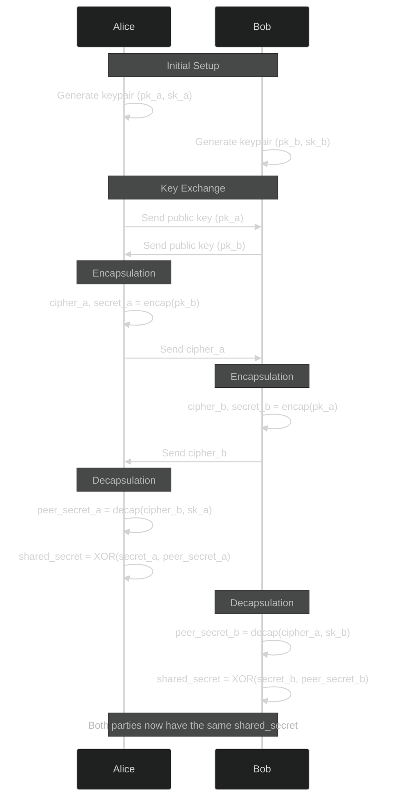

import { Button } from '@/components/ui/button'
import Link from 'next/link'

  <Link href={"https://pqchat.minhified.codes"} target='_blank'>
    <Button>Check out the app</Button>
  </Link>

# Introduction

On a daily basis, I often find myself on calls working with colleagues on our infrastructures. We
often have the need to send each other commands / snippets of code that have some secrets in them.

There are clearly already solutions out there for sharing ephemeral secrets (such as [this one](https://www.crypt.fyi/)), 
but I frankly don't always feel comfortable using a third-party tool. So I figured, this might be 
a fun opportunity to write a fun tool for myself.

More than anything, this is an excuse to have some fun building stuff, and it sure was fun.

# The Tech Stack

- **Next.js**
    
    Easy decision here, this is the most flexible and feature-rich way to build a web app these 
    days IMO.

- [**mlkem**](https://www.npmjs.com/package/mlkem)
    
    A JS implementation of the ML-KEM key encapsulation recently standardized by NIST. This
    implementation was done by [Ajitomi Daisuke](https://github.com/dajiaji) at Toshiba. 

    We'll briefly cover Key Encapsulation Mechanism in a little more detail below.

    大介さん、ありがとうございます！

- **WebRTC**

    Ideally, I wanted the chats to be peer-to-peer without flowing through any server. Nevertheless,
    some backend was still necessary for the signaling... I was going to keep things simple by
    making a simple websocket relay, but changed my mind when I decided on deployment with:

- [**Vercel**](https://vercel.com/)

    This choice does place a limitation since Vercel doesn't provide any support for long-running
    processes (I kind of miss ZEIT's `now.sh` here). 
    
    Since I need a signaling channel without my own server, a third-party pubsub or message broker
    was needed, for which I went for:

- [**Ably**](https://ably.com/)

    Basically a cloud-hosted pubsub as a service. They have a ton of features, but I just needed
    something simple enough to let me send a JSON from one client to another.

- [**Metered**](https://metered.ca/)
    
    Despite being p2p, WebRTC still often requires the fallback to TURN servers in practice. Metered
    provide these as a service, with a free tier.

- [**Auth0**](https://auth0.com/)
    
    To be able to let users know who they are talking to, I still wanted a user identity system.
    Clearly rolling my own was not worth it for myself as the developer, nor as a user. So I went
    for the good-old Auth0.

# On Key Encapsulation (KEM)
I wanted to dedicate a small section on KEM and key exchange, since most folks are not cryptographers
(neither am I).

You're probably familiar with symetric encryption, where a secret string is used to encrypt and
decrypt data. This is great for secure securing data at rest, where encryption and decryption is
performed by the same key, it is not directly useful when trying to secure a communication channel.

# Challenges
- Serverless signaling
- WebRTC connection issues

# Lessons Learned
- WebRTC still needs a server more often than not
- Web crypto API

# Limitations
- 1-on-1 sessions only
- Limits on free resources
- The public key that's exchanged are not signed

# Conclusion
